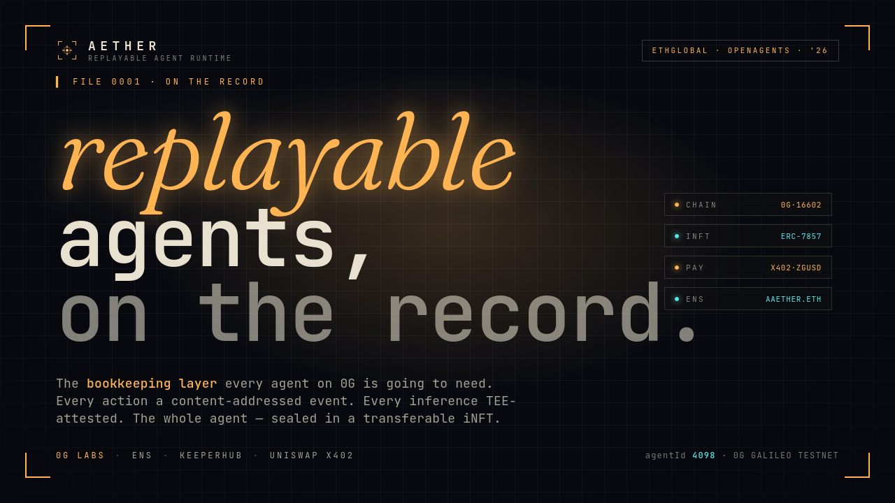

<p align="center">
  
</p>

<h1 align="center">Aether</h1>

<p align="center">
  <b>Replayable, mintable agent runtime on 0G.</b><br>
  <i>The bookkeeping layer every agent on 0G is going to need.</i>
</p>

<p align="center">
  ETHGlobal <b>OpenAgents 2026</b> &nbsp;·&nbsp; one project, four sponsor tracks
</p>

---

## What this is

**Aether** is a runtime layer for AI agents on 0G. Every action an agent takes — every inference, every tool call, every observation — becomes a content-addressed event in 0G Storage. Every inference carries a TEE attestation from 0G Compute. The full agent history seals into a transferable ERC-7857 iNFT, sold on-chain via x402 with our native ZGUSD stablecoin, named and resolved live via ENS.

Aether is the **framework**. To prove it works, we built one agent on top of it — **Thornbury**, a self-financing research agent — and shipped the whole loop end to end on 0G Galileo testnet.

---

## Live links

| What | Where |
|---|---|
| **Live ENS — Aether root** | [`aaether.eth`](https://sepolia.app.ens.domains/aaether.eth) |
| **Live ENS — Thornbury subname** | [`thornbury.aaether.eth`](https://sepolia.app.ens.domains/thornbury.aaether.eth) |
| **AgentNFT (ERC-7857) contract** | [`0x7b09a6…3910f`](https://chainscan-galileo.0g.ai/address/0x7b09a692d9d6c55b9Ed8ddf61e9cde847cC3910f) |
| **AetherVerifier contract** | [`0x9f4FF2…4070`](https://chainscan-galileo.0g.ai/address/0x9f4FF2Bf926D63045023B5E3790AE13A39184070) |
| **ZGUSD stablecoin (EIP-3009 on 0G)** | [`0xcCd666…AbfF`](https://chainscan-galileo.0g.ai/address/0xcCd66655fF08b5A25a6bf4bc3b51d380c976AbfF) |
| **ERC-8004 agent identity** | [agentId `4098` on Sepolia IdentityRegistry](https://sepolia.etherscan.io/address/0x8004A818BFB912233c491871b3d84c89A494BD9e) |
| **Agent card (IPFS)** | `ipfs://Qme9nLUt2z3MAB7VVcPMLfQh3XgZBRge9Mgfqs87NhG32z` |

Resolve `thornbury.aaether.eth` three times during the demo — three different head values come back, because they're three different agent states. The dynamic record `agent.aether.head` is served live from 0G Storage via CCIP-Read.

---

## Table of contents

1. [The thesis](#the-thesis)
2. [What we built](#what-we-built)
3. [Architecture overview](#architecture-overview)
4. [Live deployments](#live-deployments)
5. [Repo layout](#repo-layout)
6. [Local setup — prerequisites](#local-setup--prerequisites)
7. [Local setup — step-by-step](#local-setup--step-by-step)
8. [Running the demo end-to-end](#running-the-demo-end-to-end)
9. [Per-track deep dives](#per-track-deep-dives)
10. [Contract reference](#contract-reference)
11. [Event schema](#event-schema)
12. [Buyer flow — x402 + ZGUSD walkthrough](#buyer-flow--x402--zgusd-walkthrough)
13. [Replay flow](#replay-flow)
14. [ENS dynamic resolution](#ens-dynamic-resolution)

---

## The thesis

Existing standards already define how an agent is **named** (ENS / ERC-8004) and **owned** (ERC-7857). What none of them define is what an agent **is**.

Today, when you mint an agent on 0G, what you mint is a snapshot. A `character.json`. Maybe some weights. The buyer gets a clone — not a being. There is no record of what the agent has done, no proof of which model it ran, no way to replay its decisions. That is the gap Aether fills.

> **Aether is the missing primitive: the agent's life as a content-addressed, encrypted, replayable log on 0G Storage, frozen into the iNFT, sold via x402, resolved live via ENS.**

That gap blocks four real markets:

- **Insurance** — you can underwrite an agent's behaviour only if you can audit it after the fact.
- **Resale** — provenance multiplies value; opaque agents trade as commodities.
- **Compliance** — every AI regulation in flight requires post-hoc replay.
- **Trust** — buyers of agent output deserve to verify what produced it.

Aether unlocks all four.

---

## What we built

### Aether — the framework (what's competing)

| Layer | What it is | Where |
|---|---|---|
| **Aether SDK** | TypeScript runtime that records typed events into a Merkle-linked log on 0G Storage and surfaces a clean replay API | [`sdk/`](./sdk/) |
| **AetherVerifier.sol** | Custom signature-based `IERC7857DataVerifier` for the ERC-7857 reference contract | [`contracts/src/AetherVerifier.sol`](./contracts/src/AetherVerifier.sol) |
| **AgentNFT.sol** | 0G's official ERC-7857 reference, deployed verbatim, pointed at our verifier | [`contracts/src/AgentNFT.sol`](./contracts/src/AgentNFT.sol) |
| **ZGUSD.sol** | Native ERC-20 + EIP-3009 stablecoin we deployed on 0G Galileo so the entire x402 buyer flow stays on a single chain | [`contracts/src/ZGUSD.sol`](./contracts/src/ZGUSD.sol) |
| **Frontend** | Vite + React + wagmi mission-control terminal; reads asset, network, and EIP-712 domain entirely from the server's challenge — zero hardcoded addresses | [`frontend/`](./frontend/) |
| **TEE worker** | Node.js authority that signs preimage / transfer claims (production swaps for TDX) | [`services/tee-worker/`](./services/tee-worker/) |

### Cross-track layers

| Layer | What it does |
|---|---|
| **Ammonite (ENS)** | Live agent cards via ENSIP-25 + Durin + CCIP-Read at `aaether.eth` (Sepolia) → resolves dynamic state from 0G Storage at resolve-time. [`layers/ammonite/`](./layers/ammonite/) |
| **Guard (KeeperHub)** | Wraps every on-chain settlement (mint, transfer, `authorizeUsage`) in a KeeperHub workflow with retry, audit, and a documented testnet-bug fallback. [`layers/guard/`](./layers/guard/) |
| **Payments (x402)** | Server-side x402 envelope + EIP-3009 buyer helper. [`layers/payments/`](./layers/payments/) |

### The reference agent (what Thornbury is)

**Thornbury** is the example agent we built on top of Aether to demonstrate the full loop. It picks an arxiv question, fetches papers, summarises through `qwen-2.5-7b` on 0G Compute, mints the report as an iNFT, paywalls access through x402 with ZGUSD, and refills its own 0G Compute ledger from the revenue. **A closed economic loop.**

Thornbury is in [`examples/thornbury/`](./examples/thornbury/). Aether is the engine; Thornbury is the first car off the line.

### Everything is real

Every layer is wired to **real** infrastructure — real arxiv API, real 0G Compute provider, real `Indexer.upload(MemData)` to 0G Storage, real on-chain mint, real EIP-712 signing, real `transferWithAuthorization()` settlement.

The only intentional stub is `AetherVerifier`'s ECDSA path — and it implements 0G's `IERC7857DataVerifier` interface verbatim, so production swaps the authority for an Intel TDX worker without changing a line of contract code.

---

## Architecture overview

```
┌─────────────────────────────────────────────────────────────────────┐
│                  Aether SDK (off-chain runtime)                      │
│                                                                      │
│   Agent code  ─►  Event logger  ─►  0G Storage (encrypted)           │
│        │              (canonical JSON, AES-128 master key)           │
│        ├── chat()  ─► 0G Compute broker ─► TeeML attestation         │
│        ├── tool()  ─► ToolCallEvent                                  │
│        ├── observe()  ─► ObservationEvent                            │
│        └── setState() ─► StateMutationEvent                          │
│                                                                      │
│   On finish:  Merkle root over event roots → AgentNFT.mint(...)      │
└────────────────────────────────────────────────────────────────────┬─┘
                                                                     │
                                                                     ▼
                            ┌─────────────────────────────────────────┐
                            │          0G Galileo Testnet              │
                            │          (chain id 16602)                │
                            │                                          │
                            │  AetherVerifier  (sig-based, our impl)   │
                            │  AgentNFT        (0glabs reference)      │
                            │  ZGUSD           (ERC-20 + EIP-3009)     │
                            └─────────────────────────────────────────┘

   Cross-track layers
   ──────────────────
   • Ammonite (ENS)       — aaether.eth → live agent state via CCIP-Read
   • Guard (KeeperHub)    — workflow wrapping authorizeUsage + retry/fallback
   • Payments (x402)      — challenge envelope + EIP-3009 buyer helper
```

A more detailed walkthrough lives in [`docs/architecture.md`](./docs/architecture.md) and [`docs/end-to-end-flow.md`](./docs/end-to-end-flow.md).

---

## Live deployments

All on **0G Galileo testnet — chain id 16602** unless otherwise noted.

### Core contracts

| Artifact | Address | Explorer |
|---|---|---|
| AgentNFT (ERC-7857) | `0x7b09a692d9d6c55b9Ed8ddf61e9cde847cC3910f` | [view](https://chainscan-galileo.0g.ai/address/0x7b09a692d9d6c55b9Ed8ddf61e9cde847cC3910f) |
| AetherVerifier | `0x9f4FF2Bf926D63045023B5E3790AE13A39184070` | [view](https://chainscan-galileo.0g.ai/address/0x9f4FF2Bf926D63045023B5E3790AE13A39184070) |
| ZGUSD (EIP-3009 stablecoin) | `0xcCd66655fF08b5A25a6bf4bc3b51d380c976AbfF` | [view](https://chainscan-galileo.0g.ai/address/0xcCd66655fF08b5A25a6bf4bc3b51d380c976AbfF) |
| Thornbury iNFT | token #1 | [chainscan](https://chainscan-galileo.0g.ai) |

### Ammonite (ENS) layer

| Artifact | Address / id | Network |
|---|---|---|
| ENS root name | [`aaether.eth`](https://sepolia.app.ens.domains/aaether.eth) | Sepolia |
| ENS subname | [`thornbury.aaether.eth`](https://sepolia.app.ens.domains/thornbury.aaether.eth) | Sepolia |
| L1 resolver (Durin stock) | [`0x8A968aB9eb8C084FBC44c531058Fc9ef945c3D61`](https://sepolia.etherscan.io/address/0x8A968aB9eb8C084FBC44c531058Fc9ef945c3D61) | Sepolia |
| L2 registry (Durin) | [`0x46f0058d5187b39c5cbdfa325637479bbfbf8a65`](https://sepolia.basescan.org/address/0x46f0058d5187b39c5cbdfa325637479bbfbf8a65) | Base Sepolia |
| DurinL2Registrar | [`0x41CE8E3dF8b5828B2d90057D71164d089FF2312f`](https://sepolia.basescan.org/address/0x41CE8E3dF8b5828B2d90057D71164d089FF2312f) | Base Sepolia |
| CCIP-Read gateway | `pnpm ammonite:gateway` (Node service) | local / hosted |
| `AmmoniteResolver.sol` | shipped as source for production use; demo uses Durin's stock resolver | – |

### ERC-8004 identity

| Artifact | Address / id |
|---|---|
| IdentityRegistry (Sepolia) | [`0x8004A818BFB912233c491871b3d84c89A494BD9e`](https://sepolia.etherscan.io/address/0x8004A818BFB912233c491871b3d84c89A494BD9e) |
| Agent id | `4098` |
| Agent card (IPFS) | `ipfs://Qme9nLUt2z3MAB7VVcPMLfQh3XgZBRge9Mgfqs87NhG32z` |

> All testnet deployments. Do not reuse the demo keys — they are burnable testnet keys; rotate before any production use.

---

## Repo layout

```
aether/
├── contracts/                     # Hardhat workspace
│   ├── src/
│   │   ├── AetherVerifier.sol     # IERC7857DataVerifier, sig-based
│   │   ├── AgentNFT.sol           # 0G reference, non-upgradeable variant
│   │   ├── ZGUSD.sol              # ERC-20 + EIP-3009 stablecoin on 0G
│   │   ├── AmmoniteResolver.sol   # ENS L1 resolver with CCIP-Read
│   │   ├── DurinL2Registrar.sol   # Durin subname mint helper
│   │   └── interfaces/
│   └── scripts/                   # deploy.ts, deploy-agentnft.ts, …
│
├── sdk/                           # @aether/sdk — the runtime
│   └── src/
│       ├── aether.ts              # Public Aether class
│       ├── events.ts              # Event types + canonical hashing
│       ├── compute/               # 0G Compute broker wrapper (TEE-aware)
│       ├── storage/               # 0G Storage adapter (encryption + log)
│       ├── replay/                # Deterministic replay engine
│       └── erc8004/               # ERC-8004 IdentityRegistry client
│
├── frontend/                      # Vite + React + Tailwind UI
│   └── src/
│       ├── pages/                 # Run · Replay · Buy · Spec
│       ├── components/            # EventStream, EventCard, TxLink, …
│       ├── hooks/useAgent.ts      # SSE-driven event stream
│       └── lib/                   # wagmi config, addresses, format
│
├── services/
│   └── tee-worker/                # TEE authority (Node.js dev → TDX prod)
│
├── layers/
│   ├── ammonite/                  # ENS dynamic agent cards (CCIP-Read)
│   ├── guard/                     # KeeperHub workflow wrapper
│   └── payments/                  # x402 envelope + EIP-3009 buyer
│
├── examples/
│   └── thornbury/                 # The reference agent built on Aether
│
├── scripts/
│   ├── day0/                      # 10 health checks
│   ├── e2e/                       # start-all.ts, demo-flow.ts
│   ├── setup/                     # ZGUSD mint, …
│   └── registration/              # ERC-8004 + Durin helpers
│
├── docs/                          # architecture, end-to-end, demo-script
└── submissions/                   # Per-track submission READMEs
```

---

## Local setup — prerequisites

| Tool | Version | Why |
|---|---|---|
| Node.js | **>= 22** | 0G SDKs require modern Node |
| pnpm | **>= 9** | Workspace package manager |
| git | any | clone |
| MetaMask | latest | sign EIP-712, mint, buy |

Funded testnet wallets (free faucets):

| Network | Why | Faucet |
|---|---|---|
| 0G Galileo (16602) | Deploy + run agent + mint iNFT | Discord — `discord.com/invite/0glabs` |
| Sepolia | ERC-8004 register + ENS Durin parent | publicnode.com / Alchemy |
| Base Sepolia | Durin L2 registry deploy | basescan.org faucet |

Optional: KeeperHub API token (`app.keeperhub.com`), Pinata JWT (for IPFS pinning).

---

## Local setup — step-by-step

### 1. Clone and install

```bash
git clone https://github.com/Aaether-ORG/Aether-monorepo
cd Aether-monorepo
pnpm install
```

### 2. Configure environment

```bash
cp .env.example .env
$EDITOR .env
```

Fill at minimum:

```
ZG_TESTNET_PRIVATE_KEY=0x…
AGENT_OWNER_PRIVATE_KEY=0x…
AETHER_TEE_AUTHORITY_KEY=0x…
SEPOLIA_PRIVATE_KEY=0x…
```

After deploying the contracts, set:

```
AETHER_VERIFIER_ADDRESS=
AGENT_NFT_ADDRESS=
ZGUSD_ADDRESS=
ZGUSD_NAME=ZG-USD
ZGUSD_VERSION=2
ZGUSD_DECIMALS=6
X402_NETWORK=16602
AGENT_PAYMENT_ADDRESS=0x…
AETHER_TOKEN_ID=1
ERC8004_AGENT_ID=4098
ENS_PARENT=aaether.eth
```

> **Never commit `.env`.** It is gitignored. Treat any leaked key as compromised and rotate.

### 3. Day-0 verification

```bash
pnpm day0
```

Runs 10 health checks (RPC reachable, balance > 0, 0G Compute responsive, 0G Storage upload working, ERC-8004 callable, x402 envelope round-trips, KeeperHub auth, ENS resolves, …). Each check < 30 s. Fix any RED before continuing.

After `pnpm day0:compute` succeeds, copy the printed provider address into `.env`:

```
ZG_COMPUTE_PROVIDER_ADDRESS=0x…
```

### 4. Deploy contracts

#### AetherVerifier on 0G Galileo

```bash
cd contracts
pnpm compile
pnpm test
pnpm deploy:zg
```

→ capture `AetherVerifier` address → `.env` → `AETHER_VERIFIER_ADDRESS=`.

#### AgentNFT (the ERC-7857 reference)

```bash
pnpm tsx scripts/deploy-agentnft.ts
```

→ capture `AGENT_NFT_ADDRESS` → `.env`.

#### ZGUSD (native stablecoin for x402)

```bash
pnpm tsx scripts/deploy-zgusd.ts
```

EIP-712 domain: `name="ZG-USD"`, `version="2"`, `decimals=6`. These MUST match `.env`.

Mint a test float to your buyer wallet:

```bash
pnpm tsx scripts/setup/mint-zgusd.ts --to 0xYourWallet --amount 100
```

#### (optional) AmmoniteResolver on Base Sepolia

```bash
pnpm deploy:resolver
```

### 5. Register the agent on ERC-8004

```bash
pnpm register:erc8004
```

Hits Sepolia IdentityRegistry, pins the agent card to IPFS via Pinata, sets the Durin record. Captures `agentId` (we got 4098).

### 6. Run all four services

```bash
cd ..
pnpm e2e
```

Boots:

| Service | URL |
|---|---|
| Frontend (Vite) | http://localhost:5173 |
| Thornbury server | http://localhost:3000 |
| TEE worker | http://localhost:4000 |
| Ammonite CCIP-Read gateway | http://localhost:8080 |

`Ctrl-C` stops them all.

### 7. (alternative) Run each service manually

```bash
pnpm frontend:dev          # http://localhost:5173
pnpm thornbury:server      # http://localhost:3000
pnpm tee:start             # http://localhost:4000
pnpm ammonite:gateway      # http://localhost:8080
```

---

## Running the demo end-to-end

### From the frontend

1. Open http://localhost:5173.
2. Connect a wallet — the **AUTH NODE** key prompts MetaMask. Approve chain switch to 0G Galileo (16602).
3. Pick a preset question on the Run page → click **EXECUTE ▶**.
4. Watch the event tape: `OBSRV` → `INFER` (TEE-attested) → `MUTAT` → `MINT`.
5. Mint receipt appears with the iNFT token id and a chainscan-galileo tx link.
6. Click **REPLAY ▶** to open `/agent/:tokenId` — black-box recorder reconstructs the event chain frame-by-frame, verifies all `prevHash` links.
7. Click **BUY REPORT · x402** to open `/buy`. Enter the token id (defaults to 1). The live ZGUSD ticker shows your real on-chain balance. Hit **EXECUTE ORDER**:
   - Server returns `402` with `PAYMENT-REQUIRED` header.
   - Frontend parses `accepts[0]`, reads asset / payTo / amount / EIP-712 domain — **nothing hardcoded**.
   - Wallet signs `TransferWithAuthorization` typed-data.
   - Server submits real `ZGUSD.transferWithAuthorization()` → `settleTxHash`.
   - Server calls `agentNFT.authorizeUsage(tokenId, buyer)` via Guard → `authzTxHash`.
   - Server fetches a KeeperHub audit attestation → `auditId`.
   - Three tx hashes appear in the proof block; report unlocks.

### Headless (CI-shaped)

```bash
pnpm e2e:demo "What are the most cited cell-free protein synthesis papers from Q1 2026?"
```

Health-checks every service → POSTs `/research` → consumes SSE → triggers buy with mock signature → triggers replay → calls Ammonite gateway. Exits non-zero on any failure.

---

## Per-track deep dives

### 0G — Aether SDK (framework) + Thornbury (reference agent)

We deploy `0glabs/0g-agent-nft` (eip-7857-draft branch) verbatim and add a single contract: `AetherVerifier`. The SDK is the bookkeeping primitive — `aether.chat / tool / observe / setState / mint`. Each call generates a typed event, encrypts it with the agent's AES-128 master key (16 bytes — matching ERC-7857's `bytes16 sealedKey` constraint), uploads it via `Indexer.upload(MemData, …)`, and updates the event-hash chain.

Every primitive 0G ships is wired in:

- **0G Chain (16602)** — three of our contracts: AgentNFT, AetherVerifier, ZGUSD.
- **0G Storage** — every event canonical-JSON-encoded, encrypted, uploaded with `Indexer.upload(MemData)`.
- **0G Compute** — `qwen-2.5-7b` runs in TEE; we capture the TeeML attestation and write it into the `InferenceEvent`.
- **0G Compute ledger** — refilled by Thornbury from x402 revenue. Closed economic loop on 0G primitives alone.
- **ERC-7857** — used verbatim. `dataHashes[0]` carries the Merkle root of the full event chain.

Submission → [`submissions/0g-framework/`](./submissions/0g-framework/) and [`submissions/0g-agents/`](./submissions/0g-agents/).

### ENS — Ammonite

Resolving `aaether.eth` (or `thornbury.aaether.eth`) returns three kinds of records, all through the standard ENS resolution path:

1. **ENSIP-25 binding** — text record `agent-registration[<registry>][<agentId>]` proves the ENS name maps to ERC-8004 agent id `4098` on Sepolia (`0x8004A818…BD9e`).
2. **Service discovery** — text records `agent.services.x402` and `agent.services.mcp` resolve to the agent's payment and Model Context Protocol endpoints.
3. **Live state** — text records `agent.aether.head`, `agent.uptime.last24h`, `agent.model.version` revert with `OffchainLookup` (EIP-3668) → our gateway returns the value from the agent's running event log on 0G Storage at request time.

ENSIP-25 standardises *static* binding. Ammonite is the missing **live** layer.

Submission → [`submissions/ens/`](./submissions/ens/).

### KeeperHub — Guard

Drop-in middleware that turns any on-chain settlement into a KeeperHub workflow with retry, gas optimisation, private routing, and audit trail. We hit a reproducible **Cloudflare 524 timeout** on KeeperHub's broadcaster — only on 0G Galileo (Base Sepolia returns in 539 ms). Documented in [`FEEDBACK.md`](./FEEDBACK.md) for the Builder Feedback Bounty, and shipped a **direct-fallback** path that signs locally with the KeeperHub wallet's exported key after a 90 s timeout. The flow does not break.

Submission → [`submissions/keeperhub/`](./submissions/keeperhub/).

---

## Contract reference

### AetherVerifier ([`contracts/src/AetherVerifier.sol`](./contracts/src/AetherVerifier.sol))

Implements 0G's `IERC7857DataVerifier`:

```solidity
function verifyPreimage(bytes[] calldata proofs) external view returns (PreimageProofOutput[] memory);
function verifyTransferValidity(bytes[] calldata proofs)
    external view returns (TransferValidityProofOutput[] memory);
```

Each proof is `dataHash || ECDSA(authority signs "PREIMAGE" || dataHash || authority)` (or the `"TRANSFER"` variant). Production swaps the ECDSA witness for a TDX/SGX/ZKP attestation — the contract interface is identical.

### AgentNFT ([`contracts/src/AgentNFT.sol`](./contracts/src/AgentNFT.sol))

0G's official `eip-7857-draft` reference, non-upgradeable variant. Deployed unchanged. Key entrypoints we exercise: `mint(bytes[] proofs, string[] descriptions, address to)`, `authorizeUsage(uint256 tokenId, address user)`, `transfer(address to, uint256 tokenId, bytes[] proofs)`.

### ZGUSD ([`contracts/src/ZGUSD.sol`](./contracts/src/ZGUSD.sol))

Native ERC-20 + EIP-3009 + EIP-712 stablecoin we deployed on 0G Galileo so the entire x402 flow stays on one chain. EIP-712 domain: `name="ZG-USD"`, `version="2"`, `decimals=6`. The TYPEHASH is the standard EIP-3009:

```
TransferWithAuthorization(
  address from, address to, uint256 value,
  uint256 validAfter, uint256 validBefore, bytes32 nonce
)
```

Faucet method exposed for testnet convenience.

### AmmoniteResolver ([`contracts/src/AmmoniteResolver.sol`](./contracts/src/AmmoniteResolver.sol))

ENS L1 resolver on Sepolia. Static keys read from internal storage; dynamic keys revert with `OffchainLookup(this, urls, callData, callbackFn, extraData)` per EIP-3668 — wallet calls our gateway, which returns the ABI-encoded live value.

### DurinL2Registrar ([`contracts/src/DurinL2Registrar.sol`](./contracts/src/DurinL2Registrar.sol))

Helper around Durin's L2 registry (`0x46f0058d…8a65` on Base Sepolia). Mints subnames under `aaether.eth`. The L1 setter signature is `setL2Registry(bytes32 node, uint64 chainId, address registry)` — note `uint64`, not `uint256`.

---

## Event schema

`AetherEvent` is a discriminated union of five types:

| Type | Fields |
|---|---|
| `InferenceEvent` | `model`, `promptHash`, `outputHash`, `attestation: { signature, modelId, providerAddress }` |
| `ToolCallEvent` | `tool`, `argsHash`, `resultHash` |
| `ObservationEvent` | `source`, `contentHash` |
| `StateMutationEvent` | `key`, `prevValueHash`, `newValueHash` |
| `MintEvent` | `tokenId`, `contract`, `metadataHash` |

Every event also has `ts` (timestamp) and `prevHash` (the keccak256 of the previous event's canonical JSON). Genesis prevHash is `0x000…0`.

```
eventHash = keccak256(prevHash || canonicalJSON(event))
```

Tampering with any event invalidates every downstream link. The whole agent history is verifiable in an O(n) walk. The iNFT's `dataHashes[0]` is the chained Merkle root over all event root hashes.

---

## Buyer flow — x402 + ZGUSD walkthrough

```
1. GET /report/:tokenId
   ↓
2. 402 PAYMENT-REQUIRED  +  base64-JSON header containing:
       {
         accepts: [{
           scheme: "exact",
           network: "16602",
           maxAmountRequired: "500000",       // 6-dec → 0.50 ZGUSD
           asset: "0xcCd6…AbfF",               // ZGUSD address
           payTo: "0x73A5…b9Eb",               // seller
           description: "Thornbury report",
           extra: {
             name: "ZG-USD", version: "2",
             decimals: 6, assetTransferMethod: "eip3009"
           }
         }]
       }
   ↓
3. Buyer's frontend parses accepts[0].
   Builds EIP-712 typed-data using the SERVER's name/version/asset.
   Wallet signs TransferWithAuthorization(from, to, value, validAfter, validBefore, nonce).
   ↓
4. Buyer GET /report/:tokenId  +  PAYMENT-SIGNATURE header (base64 envelope).
   ↓
5. Server submits ZGUSD.transferWithAuthorization(...)        → settleTxHash
   Server calls agentNFT.authorizeUsage(tokenId, buyer) via Guard
       → KeeperHub workflow (fallback on 524 timeout)         → authzTxHash
   Server fetches a KeeperHub audit attestation               → auditId
   ↓
6. 200 OK with { report, settleTxHash, authzTxHash, auditId }
```

The frontend reads the asset, network, and EIP-712 domain entirely from the server's challenge — there is **no hardcoded asset address, chain, or token name** anywhere in [`frontend/src/pages/Buy.tsx`](./frontend/src/pages/Buy.tsx).

---

## Replay flow

```
1. Buyer reads dataHashesOf(tokenId) from AgentNFT
2. Buyer reads PublishedSealedKey events to recover their sealed master key
3. Buyer decrypts master key with their private key (ECIES on secp256k1)
4. Buyer fetches the event-log root hashes (off-chain index)
5. For each rootHash:
       download encrypted blob from 0G Storage
       decrypt with master key
       parse event
       verify prevHash links to previous frame
6. Buyer can now execute the agent's full reasoning history locally
```

The frontend's `/agent/:tokenId` page renders this as a CRT black-box recorder — frames stream onto a tape, instrumentation gauges climb, the chain integrity bar sweeps once at the end and lights up `ALL LINKS VALID`.

---

## ENS dynamic resolution

```
Anyone resolves aaether.eth (or thornbury.aaether.eth)
   ↓
Resolver.text(node, "agent.aether.head")
   ↓ isDynamicKey ?
       no  → return static value from Durin L2 registry
       yes → revert OffchainLookup(this, [gatewayUrls], callData, callback, extraData)
   ↓
Wallet/browser fetches gateway/{sender}/{data}
   ↓
Ammonite gateway:
   decode (node, key)
   GET {Thornbury}/sessions/latest/head
   return ABI-encoded string(head_hash) signed for callback
   ↓
Wallet calls Resolver.textCallback(response, extraData)
   ↓
Returns the live agent head hash
```

Static keys (ENSIP-25 binding, service endpoints) live on the Durin L2 registry. Dynamic keys flow through the gateway. Try it yourself:

- [`aaether.eth`](https://sepolia.app.ens.domains/aaether.eth) — the root agent identity
- [`thornbury.aaether.eth`](https://sepolia.app.ens.domains/thornbury.aaether.eth) — the running agent's live head

Three resolutions return three different head values.
