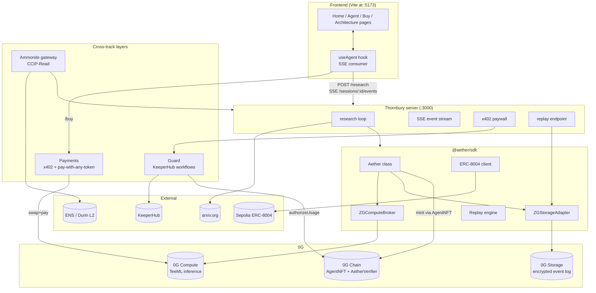
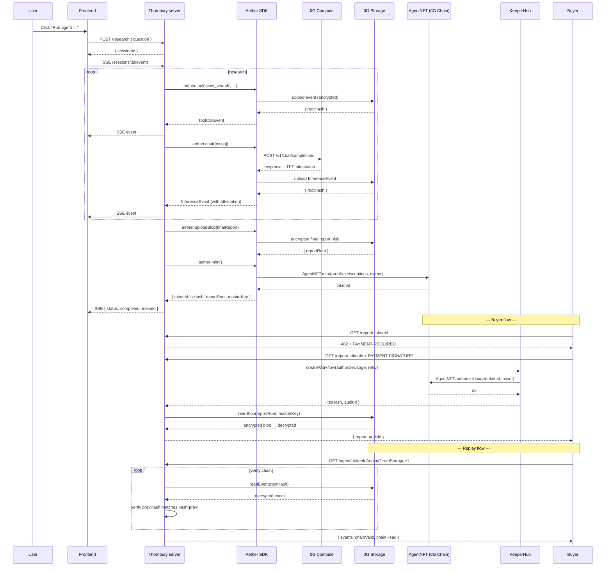
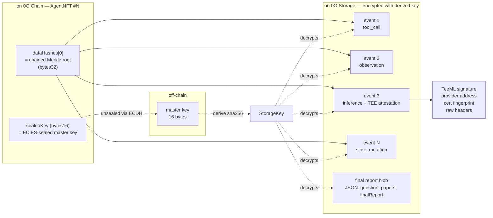
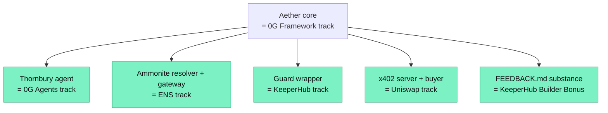

# Architecture Diagram

Render via mermaid in any GitHub README. The diagram is also embedded directly.

## System overview

## End-to-end demo flow

## Storage anatomy of one minted iNFT

## Per-track contributions

